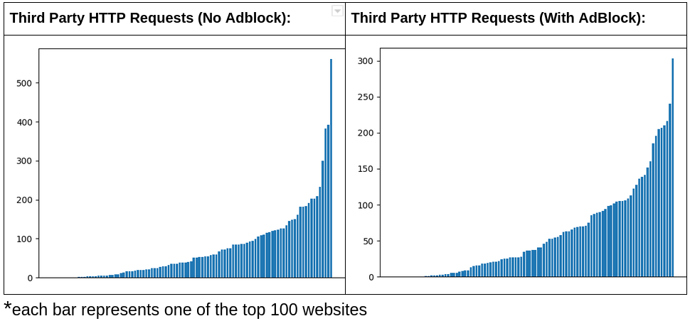
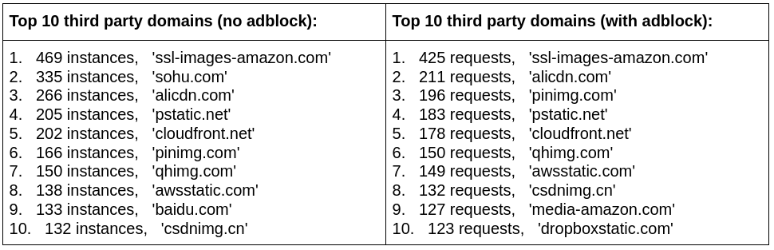
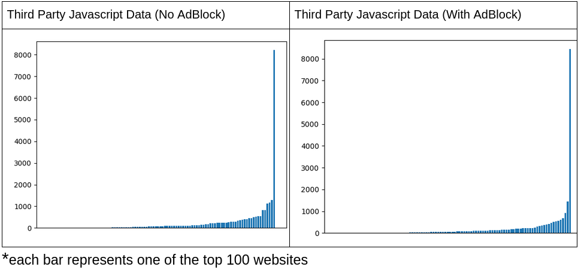
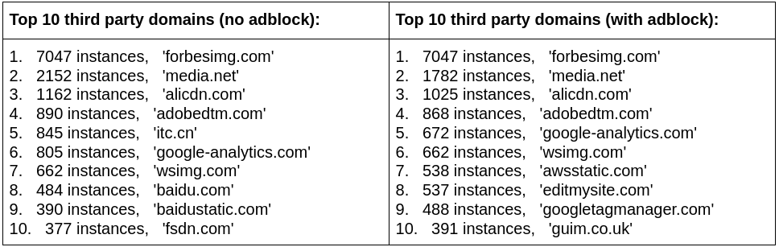
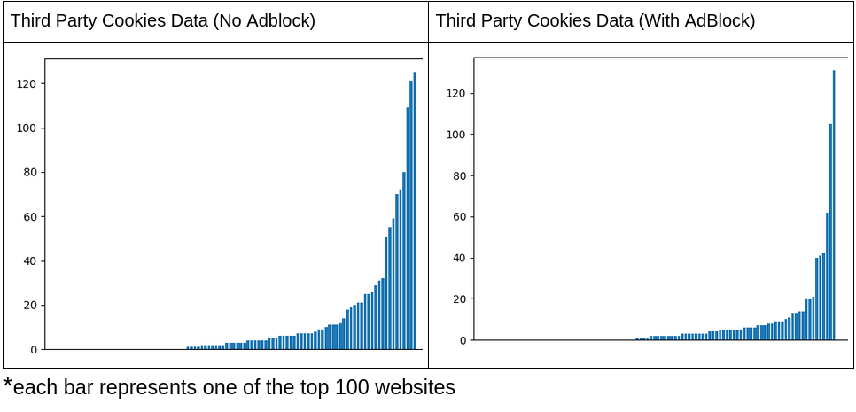
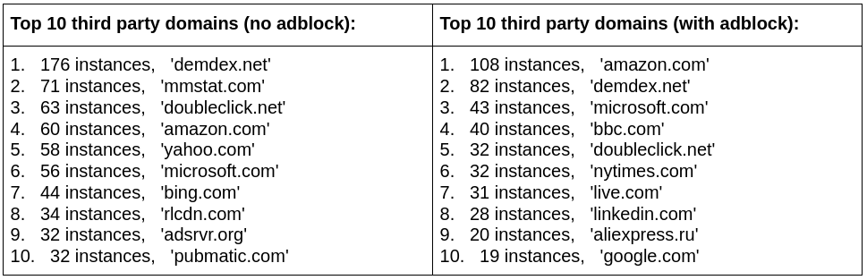

# ad-crawler
Crawl the top 100 websites and detect third party requests and compare with ad-block

## Third Party HTTP Requests

**Observations:**
* Adblock does cut off a decent number of third party http requests
* Sites with large amounts of requests dropped significantly after Adblock

**Observations:**
* Some of these seem to be for collecting user data and how they interact with the site. 
* Sohu.com, pinimg.com, baidu.com are dropped from the top 10 after adblock is applied
* Pinimg.com, awsstatic.com seem to see an increase after adblock

## Third Party Javascript

**Observations**
* Adblock seems to have somewhat minimal but still apparent effect on Javascript scripts

**Observations**
* Although Forbes has a crazy amount of third party scripts, it all seems to come from forbesimg.com.
* Contextual media seems to be directly related to advertising and is somewhat reduced
* Itc.cn, baidu.com, baidustatic.com, wsimg.com seem to have dropped by a decent amount.
* Media.net, alicdn.com, adobedtm.com, forbesimg.com, see some small drops but still have the highest requests after adblock.

## Third Party Cookies

**Observations**
* Cookies drop a lot after applying adblock
* Sites with lots of cookies seem to be the most affected

**Observations**
* Demdex, mmstat.com, Doubleclick.net, Rlcdn.com, adsrvr.org, and pubmatic.com all seem related to advertising. Almost all of them are reduced immensely after applying adblock.
*Some sites seem to gain cookies after applying adblock like amazon.com and bbc.com
